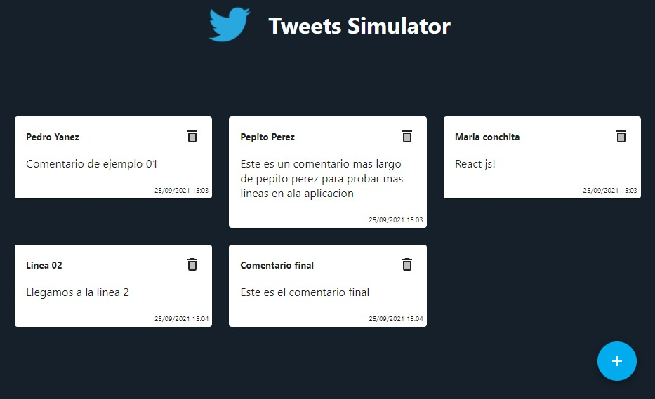

# Tweets Simulator with React

Proyecto que simula el envio de Tweets usando React!

## Scripts

Para ejecutar el proyecto, solo debes usar dos comandos

#### `npm install`
#### `npm start`

## Como librerias externas, se utilizaron:
- Material-UI
- Moments.js
- Node sass

## Instalacion individual de librerias:
En caso de que surja algun problema al momento de instalar alguna libreria en especifico, estos son los comandos para su instalacion individual.

#### Material-UI
#### `npm install @mui/material`
#### `npm install @emotion/react`
#### `npm install @emotion/styled`
#### `npm install @mui/icons-material`
#### Moments.js
#### `npm install moment --save`
#### Node-Sass
#### `npm i node-sass`
